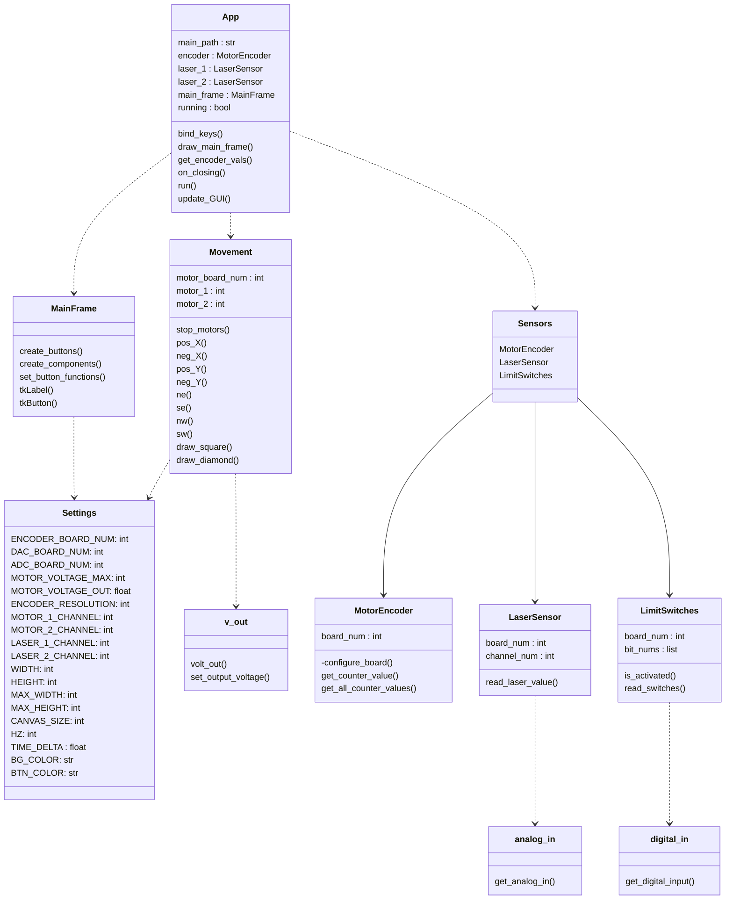

```mermaid
classDiagram

    App ..> Sensors
    App ..> Movement
    App ..> MainFrame

    MainFrame ..> Settings

    Movement ..> v_out
    Movement ..> Settings

    Sensors --> MotorEncoder
    Sensors --> LaserSensor
    Sensors --> LimitSwitches

    LimitSwitches ..> digital_in

    LaserSensor ..> analog_in

    class App{
        main_path : str
        encoder : MotorEncoder
        laser_1 : LaserSensor
        laser_2 : LaserSensor
        main_frame : MainFrame
        running : bool
        bind_keys()
        draw_main_frame()
        get_encoder_vals()
        on_closing()
        run()
        update_GUI()
    }

    class MainFrame{
        create_buttons()
        create_components()
        set_button_functions()
        tkLabel()
        tkButton()
    }


    class analog_in{
        get_analog_in()
    }

    class v_out{
        volt_out()
        set_output_voltage()
    }

    class digital_in{
        get_digital_input()
    }

    class Movement{
        motor_board_num : int
        motor_1 : int
        motor_2 : int
        stop_motors()
        pos_X()
        neg_X()
        pos_Y()
        neg_Y()
        ne()
        se()
        nw()
        sw()
        draw_square()
        draw_diamond()
    }

    class Sensors{
        MotorEncoder
        LaserSensor
        LimitSwitches
    }

    class LaserSensor{
        board_num : int
        channel_num : int
        read_laser_value()
    }

    class MotorEncoder{
        board_num : int
        -configure_board()
        get_counter_value()
        get_all_counter_values()
    }

    class LimitSwitches{
        board_num : int
        bit_nums : list
        is_activated()
        read_switches()
    }

    class Settings{
        ENCODER_BOARD_NUM: int
        DAC_BOARD_NUM: int
        ADC_BOARD_NUM: int
        MOTOR_VOLTAGE_MAX: int
        MOTOR_VOLTAGE_OUT: float
        ENCODER_RESOLUTION: int
        MOTOR_1_CHANNEL: int
        MOTOR_2_CHANNEL: int
        LASER_1_CHANNEL: int
        LASER_2_CHANNEL: int
        WIDTH: int
        HEIGHT: int
        MAX_WIDTH: int
        MAX_HEIGHT: int
        CANVAS_SIZE: int
        HZ: int
        TIME_DELTA : float
        BG_COLOR: str
        BTN_COLOR: str
    }


```
